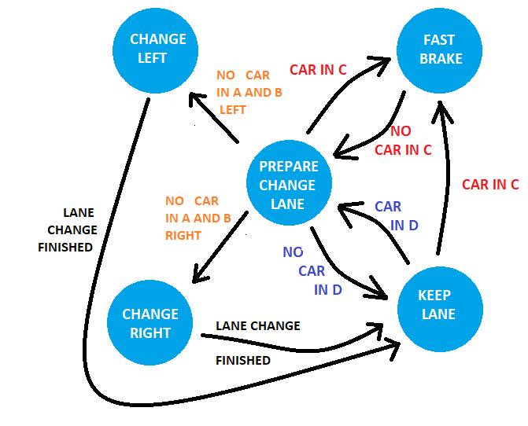
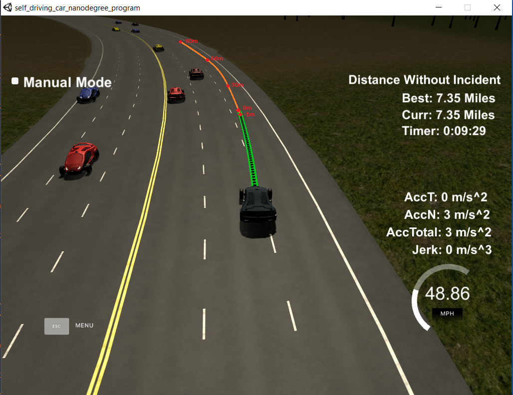
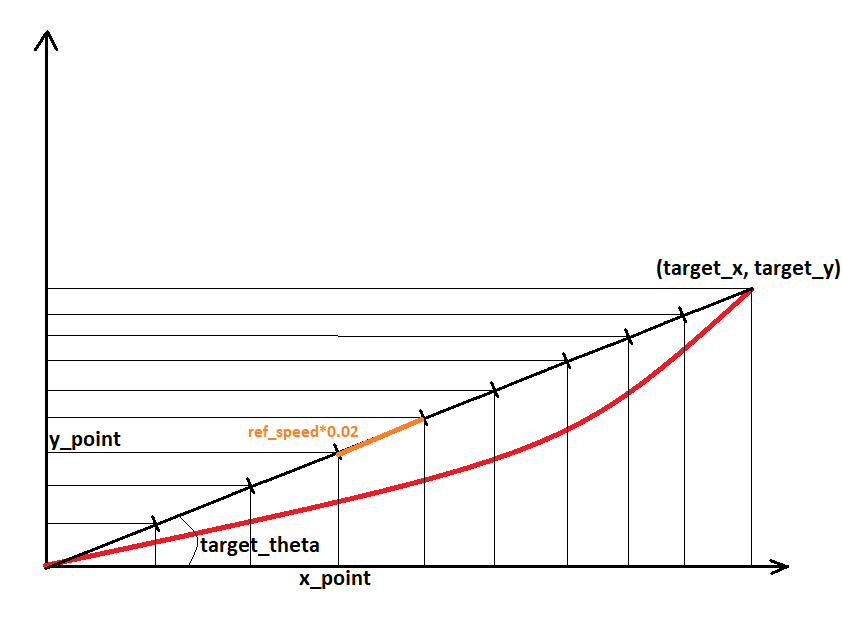

# CarND-Path-Planning-Project

Self-Driving Car Engineer Nanodegree Program, Term3. CarND-Path-Planning-Project solution by Ernesto Cañibano.

## Rubric Points

In this section i explain how to achieved to meet all the rubric points of the project. 
I started with the suggestions made in the [QA classroom video](https://www.youtube.com/watch?v=7sI3VHFPP0w&feature=youtu.be), and then I added some improvements.

### Compilation

No change was made in the project structure or in the cmake configuration. The only changes were made:
* Added new functions in the file [src/helpers.h](./src/helpers.h).
* Added file [src/spline.h](./src/spline.h) to use the [Cubic Spline Interpolation](https://kluge.in-chemnitz.de/opensource/spline/). This library is used to calculate the trajectories of the car.

### Valid Trajectories

#### The car is able to drive at least 4.32 miles without incident..

The car ran more than 20 miles without incident as can be seen in the image below.


#### The car drives according to the speed limit

The speed limit was fixed in the code with a value of 49 Mph. I none of the tests that were done, the speed limit was never exceeded.

In the firsts tests I tried to control the speed using the variable `car_speed`received from the simulator, but It generated that the control of the car was unstable.

Finally, i decided to use a global variable `ref_speed`, and not use the speed value received from the simulator.  [Line 56 to line 58](./src/main.cpp#L56).

``` 
  double ref_speed = 0.0;
  int next_lane = 2;
    
  h.onMessage([&next_lane,&ref_speed,&map_waypoints_x,&map_waypoints_y,&map_waypoints_s,
               &map_waypoints_dx,&map_waypoints_dy]
              (uWS::WebSocket<uWS::SERVER> ws, char *data, size_t length,
               uWS::OpCode opCode) {
```

#### Max Acceleration and Jerk are not Exceeded.

To avoid to exceed these maximum values (10m/s^2^ and 10m/s^3^), it is fixed an acceleration of 4 m/s^2^ for normal actions and 9 m/s^2^ for emergency actions. 
The speed is modified during the generation of the points of the trajectory, [Line 289 to line 311](./src/main.cpp#L289)
			   
#### Car does not have collisions.

The car can run more than 20 miles without collisions most of the time. But sometimes another car suddenly changes to the current lane and it is impossible to brake without exceeding the maximum acceleration allowed. In this situations 
the car tries to brake with an acceleration of 9 m/s^2 but it is not enough to avoid all the collisions.

In a real situation, these situations could be avoided by emergency braking regardless of passenger comfort.

#### The car stays in its lane, except for the time between changing lanes.
The car remains in the lane without problems except during changing lanes.

In some tests it happened that during the changing lane the traffic situation changed and the car decided to return to the original lane.
This situation caused the lane change to be longer than 3 seconds. To avoid it i decided use a global varaible `next_lane` 
and not perform any lane change until the previous change was finished.  [Line 57 to line 58](./src/main.cpp#L57).

#### The car is able to change lanes

The car can change lane in function of the position of the other cars. For it i have divided the road into
different areas as can be seen in the image below. The planner tries to analyze the behavior of the other vehicles
in each of these areas.
 


* **A**: From -5m to -20m  behind the ego car. Other cars are taken into account if their speeds are higher than the speed of the ego car.
* **B**: From -5m behind the ego car to 30m ahead of the end of the calculated trajectory. The cars are always taken into account regardless their speeds.
* **C**: From 0m ahead of the ego car to the end of the caculated trajectory. A car in this area generates an emergency situation.
* **D**: From the end of the calculated trajectory to 30m ahead. A car in this area is blocking the progress of the ego car.

The code to define this areas it can be seen in [Line 130 to line 177](./src/main.cpp#L130).

Once the situation of the traffic on the road is detected, the car has to make a decision. For it i have implemented the FSM shown below.



The description of the states are the following:

* **CHANGE LEFT**: The car moves to the left lane.
* **CHANGE RIGHT**: The car moves to the right lane.
* **KEEP LANE**: The car stays in the lane accelerating at 4 m/s^2^ per second until it reaches the maximum speed of 49 mph.
* **FAST BRAKE**: The car brakes at 9 m/s^2^ to avoid a collision.
* **PREPARE CHANGE LANE**: The car stays in the lane at constant speed equal that the speed of the car ahead.

The code of the FSM can be seen in [Line 180 to line 211](./src/main.cpp#L180).

### Reflection

In this section the code model for generating paths is described in detail.

To generate the path we start from one of the two assumptions:
* If a previous path exist, the last two points are used as the beginning of the new path. In this way it is achieved that the new trajectory is tangent to the previous trajectory. [Line 231 to line 236](./src/main.cpp#L231)
* If a previous path doesn't exist, it is used the current position of the car as the second point. To get the firs point, an imaginary point is calculated using the yaw angle of the car and going 1 meter backwards. [Line 239 to line 250](./src/main.cpp#L239)

Once the two first points have been obtained, three more equispaced points 30 meters. We these five points, a spline
line is generated to achieve a smooth trajectory. It can be seen in the image below, and the code is located in 
[Line 250 to line 280](./src/main.cpp#L250).



To use the Cubic Spline Interpolation, it is necessary that the x points are ordered. Due this, the points of the new trajectory
will be calculated in local coordinates instead of global coordinates.

Finally, to calculate the new points and fill the trajectory until reach the 50 points, taking into account the car 
speed and car acceleration, the distance between two points is calculated as shown in the graphic below. [Line 282 to line 311](./src/main.cpp#L282)


