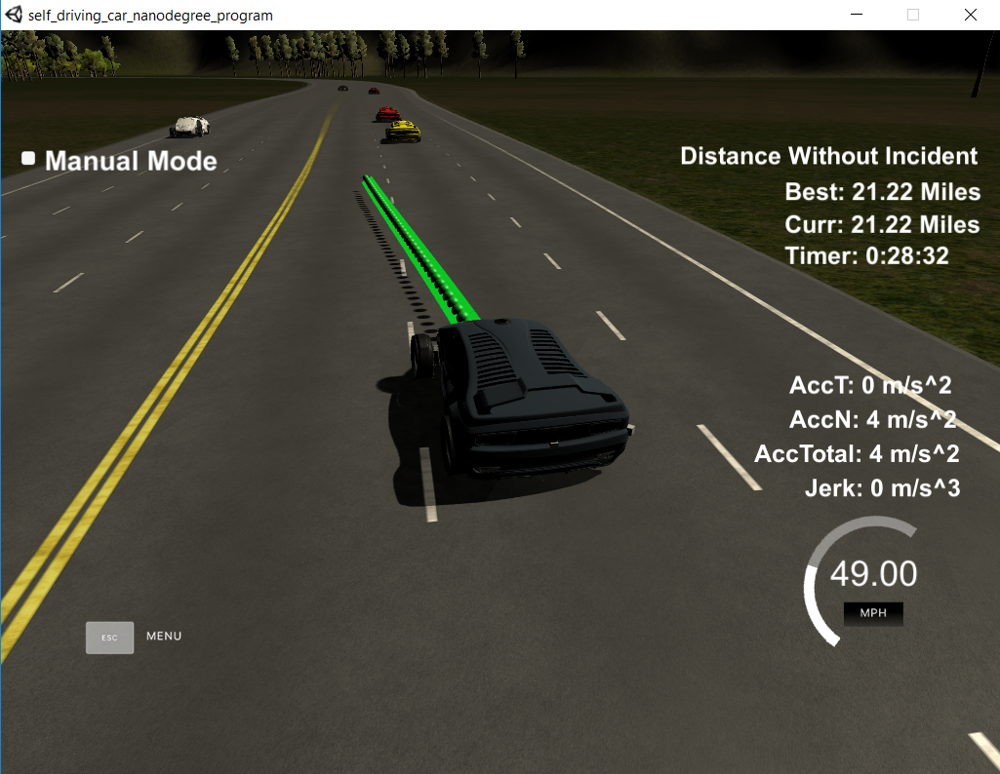
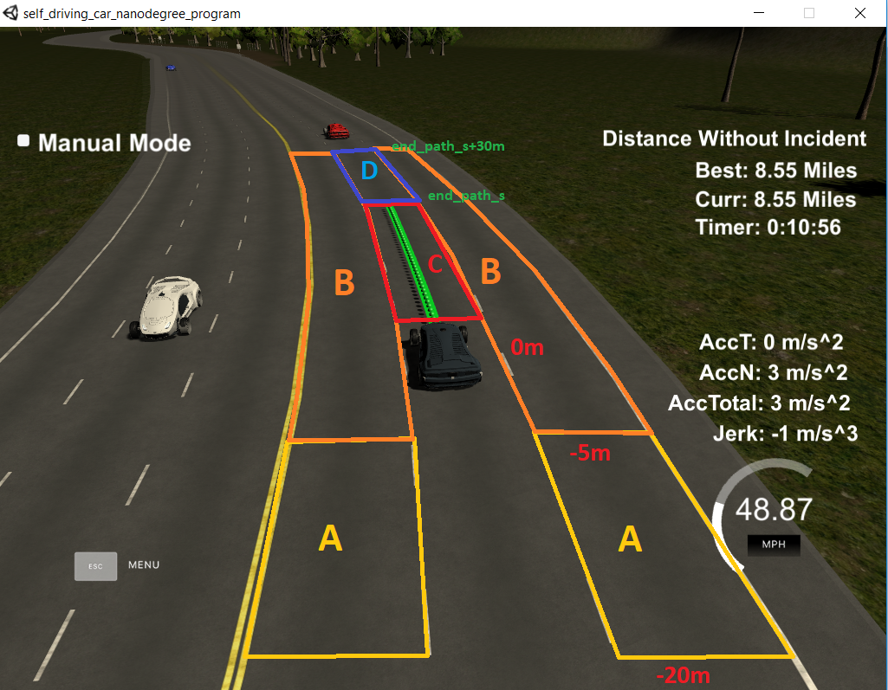

# CarND-Path-Planning-Project

Self-Driving Car Engineer Nanodegree Program, Term3. CarND-Path-Planning-Project solution by Ernesto Cañibano.

## Rubric Points

In this section i explain how to achieved to meet all the rubric points of the project. 
I started with the suggestions made in the [QA classroom video](https://www.youtube.com/watch?v=7sI3VHFPP0w&feature=youtu.be), and then I added some improvements.

### Compilation

No change was made in the project structure or in the cmake configuration. The only changes were made:
* Added new functions in the file [src/helpers.h](./src/helpers.h).
* Added file [src/spline.h](./scr/spline.h) to use the [Cubic Spline Interpolation](https://kluge.in-chemnitz.de/opensource/spline/). This library is used to calculate the trajectories of the car.

### Valid Trajectories

#### The car is able to drive at least 4.32 miles without incident..

The car ran more than 20 miles without incident as can be seen in the image below.



#### The car drives according to the speed limit

The speed limit was fixed in the code with a value of 49 Mph. I none of the tests that were done, the speed limit was never exceeded.

In the firsts tests I tried to control the speed using the variable `car_speed`received from the simulator, but It generated that the control of the car was unstable.

Finally, i decided to use a global variable `ref_speed`, and not use the speed value received from the simulator.  [Line 56 to line 58](./src/main.cpp#L56).

``` 
  double ref_speed = 0.0;
  int next_lane = 2;
    
  h.onMessage([&next_lane,&ref_speed,&map_waypoints_x,&map_waypoints_y,&map_waypoints_s,
               &map_waypoints_dx,&map_waypoints_dy]
              (uWS::WebSocket<uWS::SERVER> ws, char *data, size_t length,
               uWS::OpCode opCode) {
```

#### Max Acceleration and Jerk are not Exceeded.

To avoid to exceed these maximum values (10m/s^2^ and 10m/s^3^), it is fixed an acceleration of 4 m/s^2^ for normal actions and 9 m/s^2^ for emergency actions. 
The speed is modified during the generation of the points of the trajectory, [Line 289 to line 311](./src/main.cpp#L289)
			   
#### Car does not have collisions.

The car can run more than 20 miles without collisions most of the time. But sometimes another car suddenly changes to the current lane and it is impossible to brake without exceeding the maximum acceleration allowed. In this situations 
the car tries to brake with an acceleration of 9 m/s^2 but it is not enough to avoid all the collisions.

In a real situation, these situations could be avoided by emergency braking regardless of passenger comfort.

#### The car stays in its lane, except for the time between changing lanes.
The car remains in the lane without problems except during changing lanes.

In some tests it happened that during the changing lane the traffic situation changed and the car decided to return to the original lane.
This situation caused the lane change to be longer than 3 seconds. To avoid it i decided use a global varaible `next_lane` 
and not perform any lane change until the previous change was finished.

#### The car is able to change lanes




### Reflection

   
